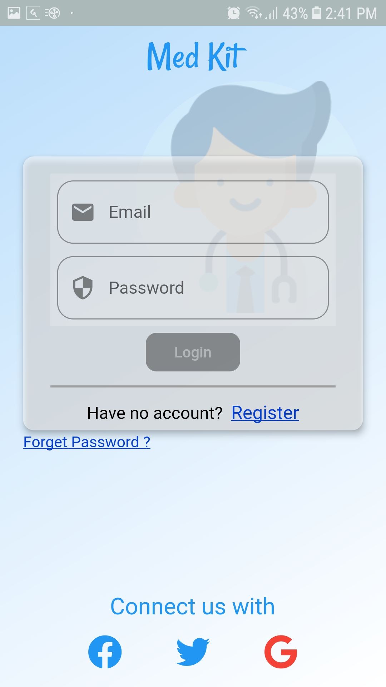
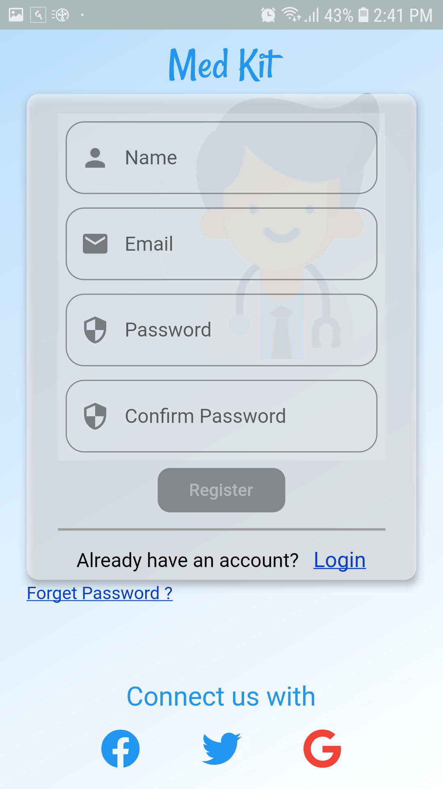
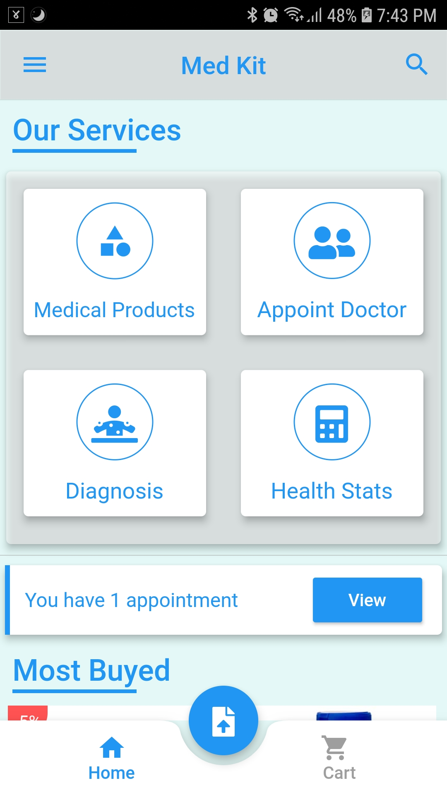
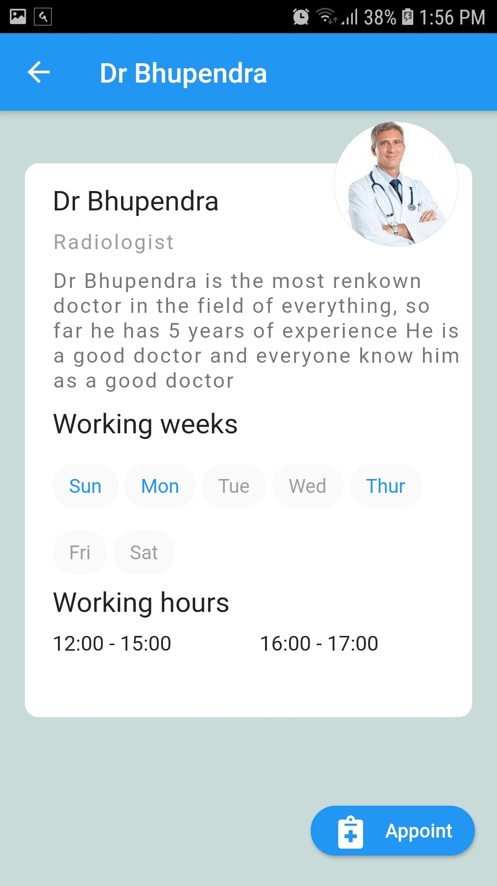
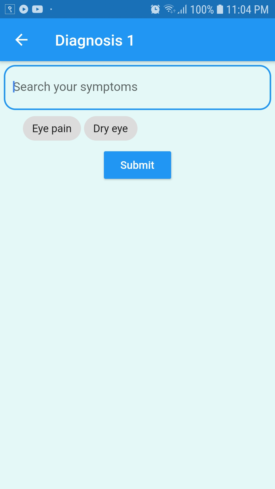
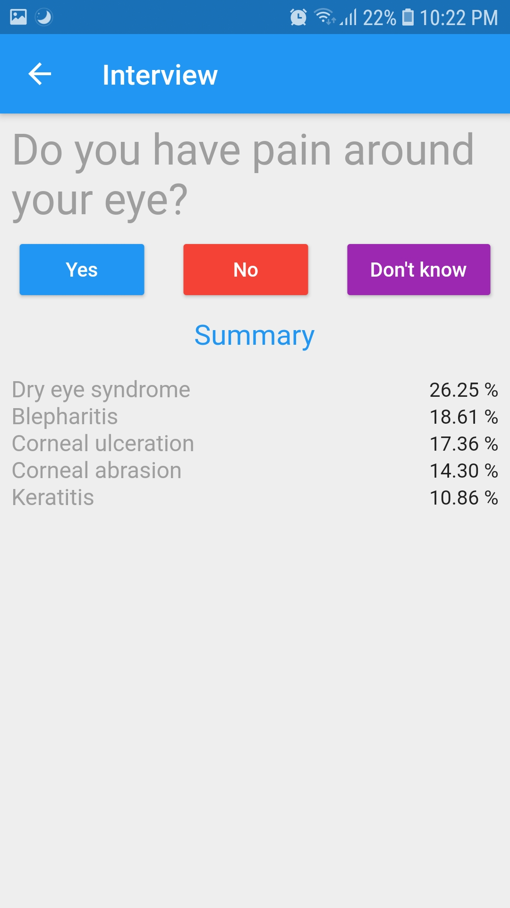
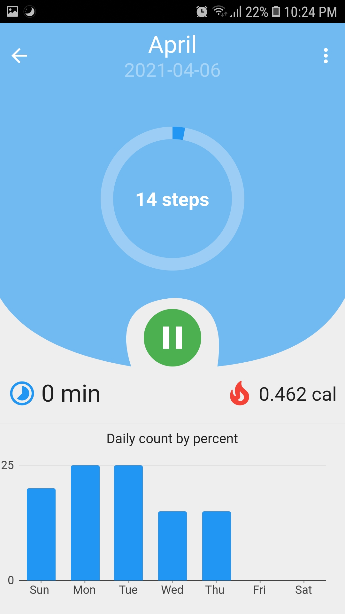
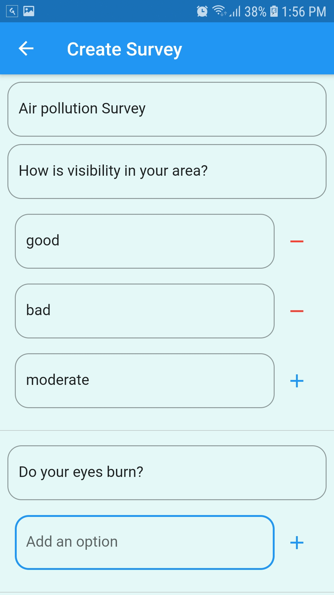
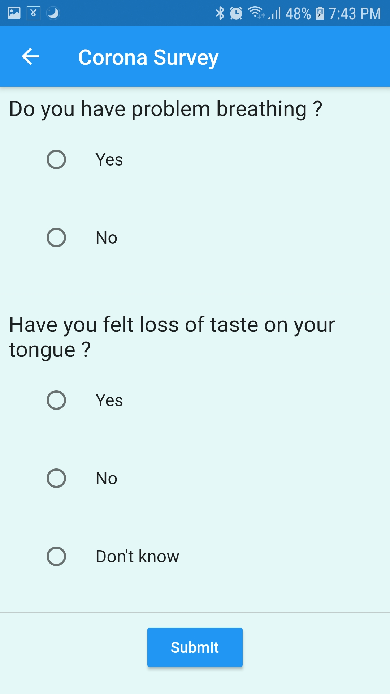
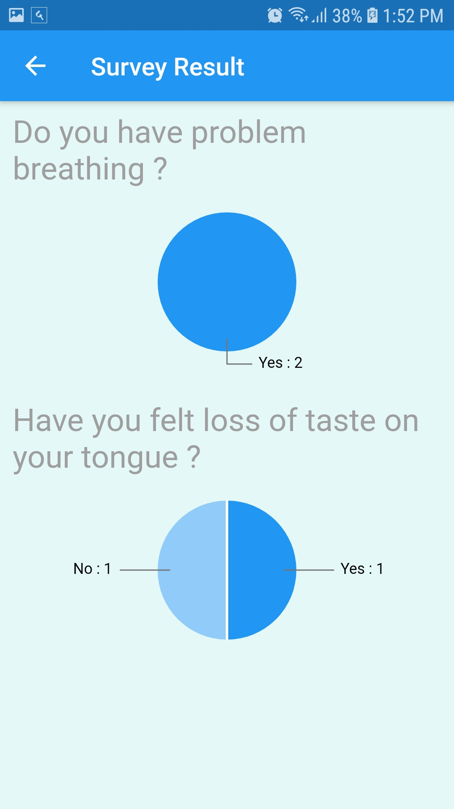

<p align='center'>
    <h2 align="center">Health Care App</h2>    
    <p align='center'>
        <a href="https://github.com/San0330/Health-Care-App" align='center'>
            
        </a>
    </p>
    <p align="center">                
        A Final Year Project
        <br/>    
        <a href="https://drive.google.com/file/d/1AOMpNd54D5079QIPThIyxhz6zmTumRX3/view?usp=sharing"> View Report <a>
    </p>
</p>

<details open="open">
    <summary>Table of Contents</summary>
  <ol>
    <li>
      <a href="#about-the-project">About The Project</a>      
    </li>
    <li>
      <a href="#features">Features</a>      
    </li>
    <li>
        <a href="#prerequisties">Prerequisites</a>
    </li>
    <li>
        <a href="#installation">Installation</a>
    </li>
    <li>
        <a href="#resources">Resources</a>
    </li>    
    <li>
        <a href="#license">License</a>
    </li>    
  </ol>
</details>

## About The Project

The project is a part of final year college project. Due to the current situation caused by Covid-19, Our team decided to contribute in the field of mobile health care system. The project uses 'symptom checker API' and simpler version of 'step detection algorithm' and also BMI calculation formula.The resources for the project are all open source and listed here (as much as I can remember).

### Tools Used

- NodeJS (for server side)
- Flutter (for client side)
- MongoDB database
- [Infermedica API](https://developer.infermedica.com/) (for symptom checking)
- [scrcpy](https://github.com/Genymobile/scrcpy) (for mirroring android screen to laptop)

## Features

- Online appointment
- Symptom checker
- Online survey
- Step Detection & BMI
- Order Medical Products
- Upload prescription ( only uploads images to server, view prescribtion list for admin is not done)

#### Auth Screen

<p>
    &nbsp;&nbsp;&nbsp;&nbsp;&nbsp;
    
</p>

#### Home Screen + Doctor Screen

<p>
    &nbsp;&nbsp;&nbsp;&nbsp;&nbsp;
    
</p>

#### Diagnosis screen + Step detection screen

<p>
    &nbsp;&nbsp;&nbsp;&nbsp;&nbsp;
        
</p>



#### Survey Screen

<p>
    &nbsp;&nbsp;&nbsp;&nbsp;&nbsp;
    
</p>



> Note: Few other screen images can be found on screenshots folder

## Prerequisties

- Flutter v1.22.5
- NodeJs (2020 version)
- Infermedica API key (2020 version)
- MongoDB (2020 version)
- Android with screen size 1080 x 1920 pixels

## Installation

> 1. download & setup flutter v1.22.5, see this [link][flutter-downgrade-link] for downgrading flutter version
> 2. also download the NodeJs code from this [link][node-js-link] & set it up
> 3. run the below commands
>
> ```
>  flutter pub get
>  flutter pub run build_runner build
>  flutter clean
> ```
>
> 3. if vsync problem occurs, see this [link][flutter-vsync-issue] & restart the IDE
> 4. goto file api_constants.dart (ctrl-p and filename may help to find it easily in VScode)
> 5. fill the api key & server url values, you can get ip address of server (if local) by running `ifconfig` in linux, make sure both server & client is on same network, infermedica api key can be found by singing in to inferemedica website, it has limited free usage as of the year 2020.
> 6. connect the android & run the command `flutter run` or `flutter run --release`

## Resources

1. Basic flutter

   - youtube, udemy & documentations, any resource is enough

2. state management in flutter

   - [Bloc + Cubit documentation](https://bloclibrary.dev/#/)
   - [Reso coder's youtube channel](https://www.youtube.com/channel/UCSIvrn68cUk8CS8MbtBmBkA)
   - [FilledStack youtube channel](https://www.filledstacks.com/)
   - any many more

   ##### some minor details

   - Bloc : for same purpose as cubit, only used for authentication part
   - Cubit : for state that fetches data from API (CRUD)
   - Cubit_CUD : cubit that deals with Create, Upate & Delete operation
   - Cubit_R : cubit that deals with Read operation
   - provider : for local UI state (ex. toggling login & register screen, detecting current open tab etc)
   - Setstate : (for quick & rough implementation, can be improved with cubit or provider)

3. Flutter app design architecture

   - DDD (Domain Driven Design) without any tests and minor rough implementations
   - Reso coders videos on DDD + few other's videos on same topic, better to go through TDD first

4. Images used from various github repos + google

## License

Distributed under the MIT License. See `LICENSE` for more information.

[flutter-downgrade-link]: https://stackoverflow.com/questions/49468321/how-to-downgrade-flutter-sdk-dart-1-x/64986246#64986246
[flutter-vsync-issue]: https://stackoverflow.com/questions/63207206/animationcontroller-the-named-parameter-vsync-isnt-defined/63460418#63460418
[node-js-link]: https://to_be_updated
